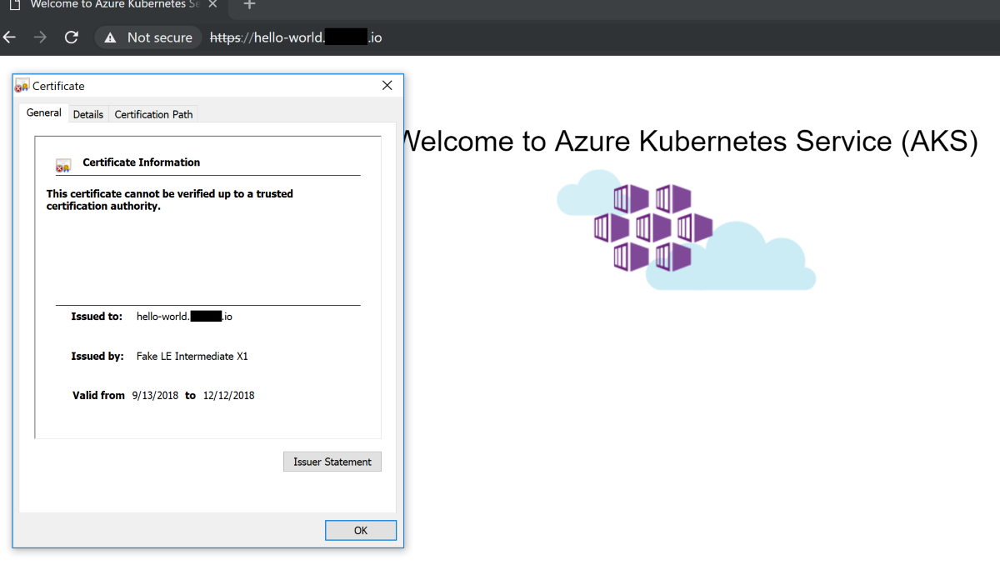

# Install Certificate Manager using http01

The goal of this step is leverage [Let's Encrypt](https://letsencrypt.org/) to perform TLS termination in the ingress controller.

The key component here is [cert-manager](https://github.com/jetstack/cert-manager) that does automatically provision of TLS certificates in Kubernetes. Underneath the hood it does the required work to adquire certificates from Let's Encrypt. This example will rely on http validation.

Let's Encrypt has a [production](https://community.letsencrypt.org/t/acme-v2-production-environment-wildcards/55578) and a [staging](https://letsencrypt.org/docs/staging-environment/) environment. Staging provides a fake certificates, but has a high rate limit. Production produces a valid certificate, but has [rate limits](https://letsencrypt.org/docs/rate-limits/). For testing purposes use the staging environment, otherwise rate limits might be reached, preventing the creation of new certificates.

## Requirements

- [You have an AKS Cluster deployed](./create-aks-cluster.md)
- [You have kubectl installed on your machine](https://kubernetes.io/docs/tasks/tools/install-kubectl/)
- [Kubectl has access to AKS cluster](https://docs.microsoft.com/en-us/azure/aks/kubernetes-walkthrough#connect-to-the-cluster)
- [You have helm installed on AKS cluster](https://docs.microsoft.com/en-us/azure/aks/kubernetes-helm)
- [Azure CLI is installed](https://docs.microsoft.com/en-us/cli/azure/install-azure-cli?view=azure-cli-latest)
- [NGINX is installed on AKS](./install-nginx-ingress.md)
- This repository is cloned/forked (or you will type yaml files)

## Guide

### 1. Using helm, install [cert-manager](https://github.com/helm/charts/tree/master/stable/cert-manager)

```bash
helm install stable/cert-manager --name cm --set ingressShim.defaultIssuerName=letsencrypt --set ingressShim.defaultIssuerKind=ClusterIssuer
```

### 2. Install the Let's Encrypt cluster issuer

```yaml
apiVersion: certmanager.k8s.io/v1alpha1
kind: ClusterIssuer
metadata:
  name: letsencrypt
spec:
  acme:
    #server: https://acme-v02.api.letsencrypt.org/directory # production
    server: https://acme-staging-v02.api.letsencrypt.org/directory # staging
    email: <your-email>
    privateKeySecretRef:
      name: letsencrypt
    http01: {}
```

### 3. Install certificate for hello-world.&lt;your-domain&gt;

```yaml
apiVersion: certmanager.k8s.io/v1alpha1
kind: Certificate
metadata:
  name: hello-world
spec:
  secretName: hello-world
  issuerRef:
    name: letsencrypt
    kind: ClusterIssuer
  dnsNames:
  - hello-world.<your-domain>
  acme:
    config:
    - http01:
        ingressClass: nginx
      domains:
      - hello-world.<your-domain>
```

### 4. Add ingress rule for hello-world.&lt;your-domain&gt;

```yaml
apiVersion: extensions/v1beta1
kind: Ingress
metadata:
  name: hello-world
  annotations:
    nginx.ingress.kubernetes.io/ssl-redirect: 'false'
    kubernetes.io/ingress.class: nginx
    kubernetes.io/tls-acme: 'true'
spec:
  tls:
  - hosts:
    - hello-world.<your domain>
    secretName: hello-world
  rules:
  - host: hello-world.<your domain>
    http:
      paths:
      - path: /
        backend:
          serviceName: aks-helloworld
          servicePort: 80
```

### 5. Watch as the certificate is adquired

```bash
kubectl describe certificates hello-world

...

Events:
  Type    Reason          Age   From          Message
  ----    ------          ----  ----          -------
  Normal  CreateOrder     39s   cert-manager  Created new ACME order, attempting validation...
  Normal  DomainVerified  4s    cert-manager  Domain "hello-world.<your domain>" verified with "http-01" validation
  Normal  IssueCert       3s    cert-manager  Issuing certificate...
  Normal  CertObtained    0s    cert-manager  Obtained certificate from ACME server
  Normal  CertIssued      0s    cert-manager  Certificate issued successfully
```

Once the certificate has been issued successfully issued (it can take a few minutes) you can move to next step and test the ingress route.

### 6. Test the ingress route

Browse to https://hello-world.your-domain and verify that the AKS Hello World app is displayed.

If you are using the staging environment you will have to accept the invalid certificate.



Using http validation requires the creation of one certificate per domain (hello-world1.&lt;your-domain&gt;, hello-world2.&lt;your-domain&gt;, etc.). In the next step we will see how we can use cert-manager to handle wildcards certificates with Azure DNS.

## Cleaning up

```bash
$ kubectl delete ingress hello-world
ingress.extensions "hello-world" deleted

$ kubectl delete certificates hello-world
certificate.certmanager.k8s.io "hello-world" deleted

$ kubectl delete ClusterIssuer letsencrypt
clusterissuer.certmanager.k8s.io "letsencrypt" deleted

$ kubectl delete secrets letsencrypt hello-world
secret "letsencrypt" deleted
secret "hello-world" deleted
```

***
[**First**](./readme.md) - [**Previous**](./install-nginx-ingress.md) - [**Next**](./setup-wildcard-certificates-with-azure-dns.md)