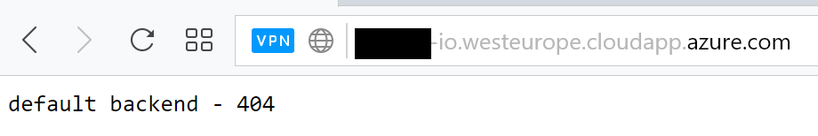
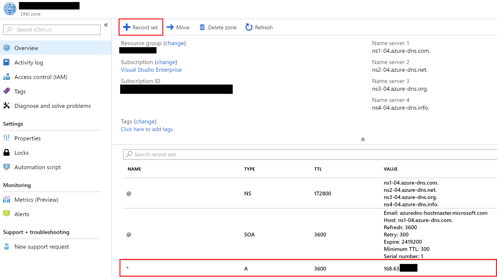

# Install NGINX Ingress

The goal of this step is to install and use nginx ingress to receive and route traffic from a custom domain.

## Requirements

- [You have an AKS Cluster deployed](./create-aks-cluster.md)
- [You have kubectl installed on your machine](https://kubernetes.io/docs/tasks/tools/install-kubectl/)
- [Kubectl has access to AKS cluster](https://docs.microsoft.com/en-us/azure/aks/kubernetes-walkthrough#connect-to-the-cluster)
- [You have helm installed on AKS cluster](https://docs.microsoft.com/en-us/azure/aks/kubernetes-helm)
- [Azure CLI is installed](https://docs.microsoft.com/en-us/cli/azure/install-azure-cli?view=azure-cli-latest)
- This repository is cloned/forked (or you will type yaml files)

## Guide

### 1. Using helm, install [nginx ingress](https://github.com/helm/charts/tree/master/stable/nginx-ingress)

```bash
helm install stable/nginx-ingress
```  

### 2. Wait until a public IP address has been associated

```bash
$ kubectl get svc -w
NAME                                          TYPE           CLUSTER-IP     EXTERNAL-IP    PORT(S)                      AGE
kubernetes                                    ClusterIP      10.0.0.1       <none>         443/TCP                      6d
torrid-gerbil-nginx-ingress-controller        LoadBalancer   10.0.135.104   168.63.26.34   80:32101/TCP,443:30399/TCP   3m
torrid-gerbil-nginx-ingress-default-backend   ClusterIP      10.0.37.193    <none>         80/TCP                       3m
```

### 3. **(Optional)** Associate the IP an Azure DNS

Using the Azure CLI associate the [IP with an Azure DNS](https://docs.microsoft.com/en-us/azure/virtual-network/virtual-network-public-ip-address#create-a-public-ip-address) (i.e. mydomain-io.westeurope.cloudapp.azure.com).

```bash
# get the Public IP resource id
az network public-ip list --query "[?ipAddress!=null]|[?contains(ipAddress, '<YOUR-IP-ADDRESS>')].[id]" --output tsv
/subscriptions/00000000-00fc-44a0-b02c-ffffffffffff/resourceGroups/MC_aks-xxxxx/providers/Microsoft.Network/publicIPAddresses/kubernetes-a26a4e576b74411e88fecd2264a455a7

# Copy the Public IP identifier and associate with an Azure DNS (must be unique)
az network public-ip update --ids /subscriptions/00000000-00fc-44a0-b02c-ffffffffffff/resourceGroups/MC_aks-xxxxx/providers/Microsoft.Network/publicIPAddresses/kubernetes-a26a4e576b74411e88fecd2264a455a7 --dns-name mydomain-io
```

Browsing to the Azure DNS will show the default ingress backend



### 4. Add a A record to your DNS Zone, pointing to the nginx public ip



After a while, browsing to www.your-domain displays the default ingress backend.

## 5. Add ingress route for www.your-domain

Let's replace the www ingress with a new deployment by installing the AKS Hello World helm chart

```bash
helm repo add azure-samples https://azure-samples.github.io/helm-charts/
helm install azure-samples/aks-helloworld
```

Apply the ingress below, pointing the aks-hello services as the default backend for www.your-domain.

```bash
apiVersion: extensions/v1beta1
kind: Ingress
metadata:
  name: www
  annotations:
    kubernetes.io/ingress.class: nginx
spec:
  rules:
  - host: www.<your-domain>
    http:
      paths:
      - path: /
        backend:
          serviceName: aks-helloworld
          servicePort: 80
```

***
[**First**](./readme.md) - [**Previous**](./create-aks-cluster.md) - [**Next**](./install-certificate-manager.md)