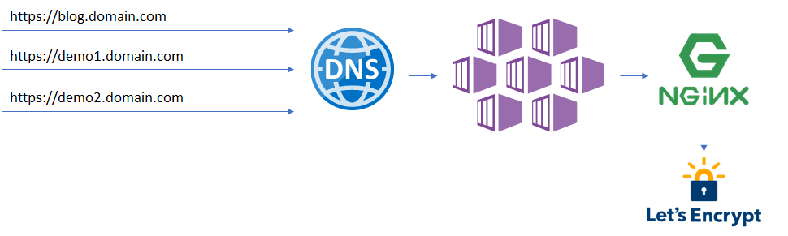

# Add TLS to AKS Ingress

This repository demonstrates how to add Kubernetes Ingress to a cluster in Azure Kubernetes Services. Moreover, it covers adding TLS termination to custom domain (i.e. www.example.com) using Let's Encrypt free services.

## Motivation

I own a Visual Studio subscription which gives me monthly [Azure credits](https://docs.microsoft.com/en-us/visualstudio/subscriptions/vs-azure). I want to optimize the credits usage to run my blog and temporary experiments seamlessly. Additionally, I would like to use my own domain.

Since I don't expect continuous and high load in any of the workloads a good option is to use AKS with [B-series VMs](https://docs.microsoft.com/en-us/azure/virtual-machines/windows/b-series-burstable). In short, B-series VMs store credits during low load, spending them during higher load. It is perfect for burst/seasonal workloads.

The end solution is looks like this:

New deployments should be able to create TLS terminated sub-domains.

## Step by step guide

1. [Use Azure DNS for a domain](./use-azure-dns-for-a-domain.md)
1. [Create AKS Cluster](./create-aks-cluster.md)
1. [Install NGINX Ingress](./install-nginx-ingress.md)
1. [Install Certicate Manager with http validation](./install-certificate-manager.md)
1. [Setup wildcard certificates with Azure DNS validation](./setup-wildcard-certificates-with-azure-dns.md)
1. [Ingress to external URL](./ingress-to-external-url.md)

## References

- [Azure Kubernetes Services](https://docs.microsoft.com/en-us/azure/aks/)
- [Kubernetes Ingress](https://kubernetes.io/docs/concepts/services-networking/ingress/)
