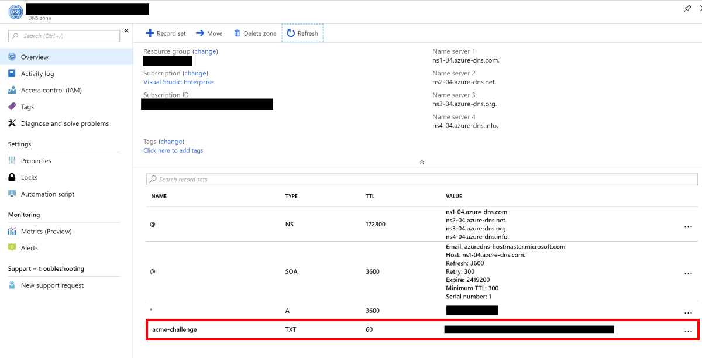

# Setup wildcard certificates with Azure DNS validation

The goal of this step is to handle TLS with a wildcard, so that a single certificate can handle multiple sub-domains.

## Requirements

- [You have an AKS Cluster deployed](./create-aks-cluster.md)
- [You have kubectl installed on your machine](https://kubernetes.io/docs/tasks/tools/install-kubectl/)
- [Kubectl has access to AKS cluster](https://docs.microsoft.com/en-us/azure/aks/kubernetes-walkthrough#connect-to-the-cluster)
- [You have helm installed on AKS cluster](https://docs.microsoft.com/en-us/azure/aks/kubernetes-helm)
- [Azure CLI is installed](https://docs.microsoft.com/en-us/cli/azure/install-azure-cli?view=azure-cli-latest)
- [NGINX is installed on AKS](./install-nginx-ingress.md)
- [Certificate Manager is installed on AKS](./install-certificate-manager.md)
- This repository is cloned/forked (or you will type yaml files)

## Guide

### 1. Delete the previous certificates and ingress routes

This step is **only required** if you already have a http based certificate issuer.

```bash
$ kubectl delete ingress hello-world
ingress.extensions "hello-world" deleted

$ kubectl delete certificates hello-world
certificate.certmanager.k8s.io "hello-world" deleted

$ kubectl delete ClusterIssuer letsencrypt
clusterissuer.certmanager.k8s.io "letsencrypt" deleted

$ kubectl delete secrets letsencrypt hello-world
secret "letsencrypt" deleted
secret "hello-world" deleted
```

### 2. Locate the service principal during the AKS cluster creation

If you don't remember, use the cli to find out:

```bash
$ az aks list --query "[].{ name: name, servicePrincipalProfile: servicePrincipalProfile }"
```

Use the value from servicePrincipalProfile/clientId.

### 3. Add the service principal as contributor of your DNS Zone

```bash
# Find out resource group of the DNS Zone
$ az network dns zone list --query "[].{ id: id, name: name}"

# Add the service principal as contributor
$ az role assignment create --assignee <service principal> --role Contributor --scope <dns-zone-id>
```

The same can be done using the Portal (Azure DNS Zone/Access control/Add)

### 4. Create secret containing the service principal password

Remember at the beginning I asked you to save the service principal details? We need it know, to allow cert-manager to talk to Azure DNS.

```bash
# get the password in base64
$ echo <the-password> | openssl base64
<the-password-in-base64>
```

Create the secret in Kubernetes:

```yaml
apiVersion: v1
kind: Secret
metadata:
  name: secret-azuredns-config
data:
  # echo <service principal password> | openssl base64
  password: <the-password-in-base64>
```

### 5. Deploy wildcard cluster issuer

Modify the certificate deployment setting

```yaml
apiVersion: certmanager.k8s.io/v1alpha1
kind: ClusterIssuer
metadata:
  name: letsencrypt
spec:
  acme:
    #server: https://acme-v02.api.letsencrypt.org/directory
    server: https://acme-staging-v02.api.letsencrypt.org/directory
    email: <your email>
    privateKeySecretRef:
      name: letsencrypt
    # Use dns-01 challenges in order to support wildcard domain names
    dns01:
      providers:
      - name: azure-dns
        azuredns:
          email: <your-email>
          # Service principal client id
          clientID: <service principal client id>
          # Secret with the password
          clientSecretSecretRef:
            key: password
            name: secret-azuredns-config
          # Name of the DNS Zone
          hostedZoneName: <your-domain>
          # Resource group where the DNS Zone is located
          resourceGroupName: <resource group where DNS zone is>
          subscriptionID: <your subscription id>
          tenantID: <your tenant id>
```

### 6. Deploy certificate

```yaml
apiVersion: certmanager.k8s.io/v1alpha1
kind: Certificate
metadata:
  name: wildcard
spec:
  secretName: wildcard
  issuerRef:
    name: letsencrypt
    kind: ClusterIssuer
  commonName: '*.<your-domain>'
  dnsNames:
  - <your-domain>
  acme:
    config:
    - dns01:
        provider: azure-dns
        ingressClass: nginx
      domains:
      - '*.<your-domain>'
      - <your-domain>
```

Wait for certificate to be validated (it takes a few minutes, be patient). You can see that a new record has been added to the Azure DNS Zone.



```bash
# For staging
$ kubectl describe certificate wildcard

...
Events:
  Type    Reason          Age               From          Message
  ----    ------          ----              ----          -------
  Normal  CreateOrder     4m                cert-manager  Created new ACME order, attempting validation...
  Normal  DomainVerified  15s (x2 over 3m)  cert-manager  Domain "<your domain>" verified with "dns-01" validation
  Normal  IssueCert       14s               cert-manager  Issuing certificate...
  Normal  CertObtained    12s               cert-manager  Obtained certificate from ACME server
  Normal  CertIssued      11s               cert-manager  Certificate issued successfully
```

### 7. Add ingress rule for hello-world.&lt;your-domain&gt;

```yaml
apiVersion: extensions/v1beta1
kind: Ingress
metadata:
  name: hello-world
  annotations:
    nginx.ingress.kubernetes.io/ssl-redirect: 'false'
    kubernetes.io/ingress.class: nginx
    kubernetes.io/tls-acme: 'true'
    certmanager.k8s.io/acme-challenge-type: dns01
    certmanager.k8s.io/acme-dns01-provider: azure-dns
spec:
  tls:
  - hosts:
    - hello-world.<your-domain>
    secretName: wildcard
  rules:
  - host: hello-world.<your-domain>
    http:
      paths:
      - path: /
        backend:
          serviceName: aks-helloworld
          servicePort: 80
```

I takes a while until the ingress rule is applied, be patient.

### 8. Test the ingress route

Browse to https://hello-world.your-domain and verify that the AKS Hello World app is displayed.

If you are using the staging environment you will have to accept the invalid certificate.


## Cleaning up

```bash

$ kubectl delete secret secret-azuredns-config
secret "secret-azuredns-config" deleted

$ kubectl delete ingress hello-world
ingress.extensions "hello-world" deleted

$ kubectl delete certificates wildcard
certificate.certmanager.k8s.io "wildcard" deleted

$ kubectl delete ClusterIssuer letsencrypt
clusterissuer.certmanager.k8s.io "letsencrypt" deleted

$ kubectl delete secrets letsencrypt wildcard
secret "letsencrypt" deleted
secret "wildcard" deleted
```

## Limitations

The limitations of having a wildcard TLS certificate is that all ingress and services being exposed must reside in the same namespace. The reason is that we only deploy one certificate (valid for all domain) that must be referenced by the ingress. The ingress references a service, that must exist in the same namespace.

If you need to deploy application with ingress routes in multiple namespaces use the http based validation described in the [previous step](./install-certificate-manager.md).

## Troubleshooting

The cert-manager communication can be viewed by looking at events.

```bash
$ kubectl get events -w
```

Another way to find out what is happening is by look at the logs of the cert-manager pod (the pod name is something like cm-cert-manager).

```bash
$ kubectl get pods
NAME                                                           READY     STATUS    RESTARTS   AGE
acs-helloworld-early-hedgehog-679b668d8b-nv7lc                 1/1       Running   0          3d
cm-cert-manager-5c9766449d-mgbvj                               1/1       Running   0          52m
torrid-gerbil-nginx-ingress-controller-754bc7467b-ctq55        1/1       Running   0          1d
torrid-gerbil-nginx-ingress-default-backend-76577b6497-q25vx   1/1       Running   0          1d

$ kubectl logs cm-cert-manager-5c9766449d-mgbvj -f
```

Sometimes restarting the cert-manager pod fixes the problem (when you trying stuff).

You might face problems when using Let's Encrypt in production due to [rate limits](https://letsencrypt.org/docs/rate-limits/).

```text
I0914 13:19:26.610058       1 sync.go:288] Error issuing certificate for default/wildcard: error getting certificate from acme server: acme: urn:ietf:params:acme:error:rateLimited: Error finalizing order :: too many certificates already issued for exact set of domains: *.<your-domain>,<your-domain>: see https://letsencrypt.org/docs/rate-limits/
E0914 13:19:26.610097       1 sync.go:197] [default/wildcard] Error getting certificate 'wildcard': secret "wildcard" not found
E0914 13:19:26.709626       1 controller.go:180] certificates controller: Re-queuing item "default/wildcard" due to error processing: error getting certificate from acme server: acme: urn:ietf:params:acme:error:rateLimited: Error finalizing order :: too many certificates already issued for exact set of domains: *.<your-domain>,<your-domain>: see https://letsencrypt.org/docs/rate-limits/
```

In my experience, after a while, the problem is solved. Hence, the recommendation to use staging when trying out.

***
[**First**](./readme.md) - [**Previous**](./install-certificate-manager.md) - [**Next**](./ingress-to-external-url.md)