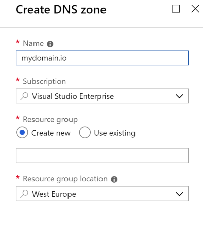
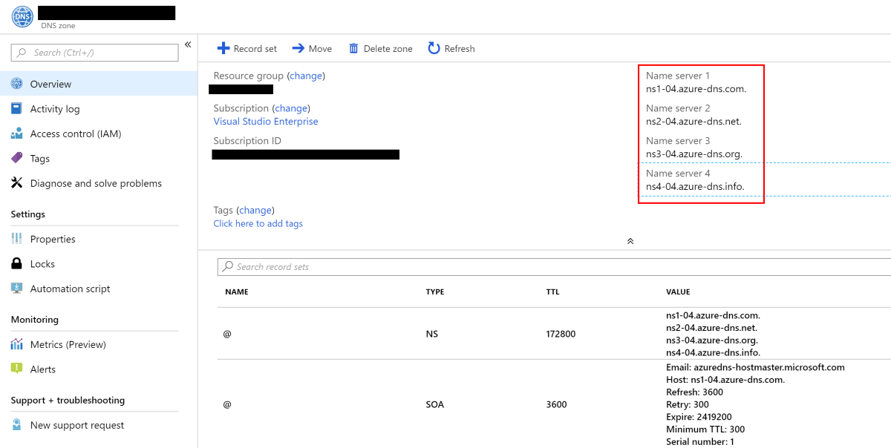

# Use Azure DNS for a domain

## Requirements

- You have an Azure Subscription
- You own a domain
- You can switch the domain DNS resolution to Azure

## Guide

1. Create a DNS Zone in Azure

1. Update the name servers of your domain. This requires a change in the service where the domain was purchased (GoDaddy, etc.)

1. It can take a while before the DNS changes are visible

***
[**First**](./readme.md) - [**Previous**](./readme.md) - [**Next**](./create-aks-cluster.md)